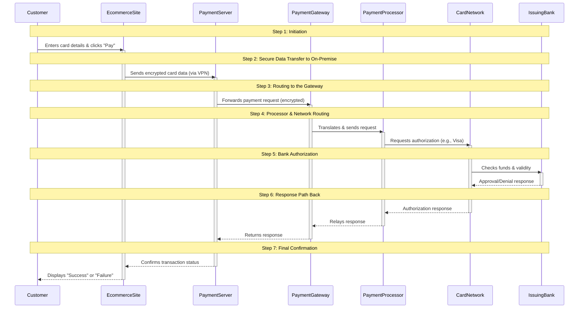

### Payment Process Sequence Diagram

---

The Core Problem: Why You Can't Talk Directly to Visa
At its heart, a payment card transaction is a message asking a customer's bank (the Issuing Bank) if a charge is acceptable. However, you, as a merchant, cannot send this message directly to Visa or MasterCard. These card networks operate massive, secure, and highly regulated global systems. They do not accept connections from millions of individual online stores for critical reasons: security, standardization, and scale. Managing and securing connections from every business in the world would be impossible. Instead, they only work with a limited number of accredited partners. This is where the layered architecture of payment processing comes in.

The Payment Ecosystem: The Roles of Each Player
Think of the process as a relay race where the baton (the payment data) is passed between specialized runners. Each has a specific job and a specific reason for existing.

1. Your Payment Processing Server (On-Premise CDE)

What it is: This is your own server, physically located in your company's infrastructure or private cloud (On-Premise). It is the core of your Cardholder Data Environment (CDE) – the secured, isolated network segment where sensitive authentication data is handled.

Why you have it (The "Why"):

Control and Security: You have direct control over its security. You can implement custom firewalls, intrusion detection systems, and access controls that meet your specific risk profile.

Data Minimization: It ensures that raw card data from your website never touches your general application databases in the public cloud (like GCP or AWS). This drastically reduces the scope of your systems that need to comply with the strict PCI DSS (Payment Card Industry Data Security Standard). The cloud platform only handles an order ID, not the card number.

Orchestration: It acts as your internal command center. It receives the raw data, decides where to route it (e.g., to different payment gateways based on card type), manages the transaction state, and handles the response.

Its Responsibilities:

Receive: Accept the encrypted card data from your E-commerce platform via a secure VPN tunnel.

Prepare & Encrypt: It often performs additional encryption or tokenization (e.g., converting the card number into a unique token) before sending it onward. It formats the request into a standard package.

Route: Send the request to the correct Payment Gateway.

Manage: Hold the state of the transaction, wait for the response, and relay it back to the E-commerce platform.

2. The Payment Gateway (The Secure Bridge)

What it is: A service provided by a third-party company (e.g., Stripe, Braintree, CyberSource, Adyen). It is the critical "bridge" between your internal systems and the external financial world.

Why it exists (The "Why"):

Abstraction: It simplifies the incredibly complex process of communicating with hundreds of different banks and processors into a single, simple API call for your developer. Without it, you would need to build and maintain direct connections to dozens of partners.

Security: It provides a secure endpoint for your data to leave your network. They are PCI DSS compliant, meaning they handle the burden of securing data in transit and at rest once it leaves your server.

Unification: It can connect to multiple Payment Processors, allowing you to offer various payment methods (e.g., digital wallets, local payment methods) through one integration.

Its Responsibilities:

Translate: Convert the request from your server's format into the specific format required by the Payment Processor it will use.

Route: Send the translated request to the appropriate processor.

Return: Receive the response from the processor and send it back to your Payment Server.

3. The Payment Processor (The Accredited Partner)

What it is: A financial institution (e.g., Fiserv, Global Payments, Chase Paymentech) that is directly accredited by Visa and Mastercard. They have a direct contractual relationship with the card networks.

Why it exists (The "Why"):

Acquiring Bank's Agent: The processor acts on behalf of your Acquiring Bank (the bank that gives you a merchant account and settles your funds). Your merchant account is often held at the acquiring bank, but the processor handles the technical communication.

Network Access: They possess the direct, secure, and authorized physical and logical connections to the card networks.

Risk & Settlement: They often handle fraud screening, batch processing of transactions, and the movement of funds between banks.

Its Responsibilities:

Route: Take the request from the Gateway and send it through the appropriate card network (VisaNet, Banknet).

Facilitate: Manage the settlement process at the end of the day, moving money from the issuing banks to your acquiring bank.

4. The Card Network (The Switch)

What it is: Visa, Mastercard, American Express, etc. They are the "switches" of the financial world.

Why they exist (The "Why"):

Interoperability: They create a universal system where a card from any bank in the world can be used at any merchant in the world that accepts that network.

Rules & Standards: They set the rules, security standards (PCI DSS), and interchange fees for every transaction.

Its Responsibilities:

Route: Receive the authorization request from the Processor and route it to the correct Issuing Bank (the customer's bank).

Return: Receive the "Approval" or "Decline" response from the Issuing Bank and send it back through the chain.

The Complete Flow in Detail
Initiation: A customer enters their card details on your website hosted on Google Cloud (GCP). Your website uses a JavaScript library to encrypt the data the moment it is entered, before it ever touches your web server. This is a key PCI requirement.

Secure Handoff: The encrypted data is sent via a secure VPN tunnel from the cloud directly to your On-Premise Payment Server. This keeps the data off public internet pathways and within your controlled environment.

Orchestration: Your Payment Server receives the data, validates it, performs any initial fraud checks, and prepares the request. It then sends this packaged request to your contracted Payment Gateway's API endpoint.

Translation & Routing: The Payment Gateway validates your merchant identity, translates the request into the format needed by your specific Payment Processor, and forwards it.

Network Authorization: The Payment Processor receives the request and routes it through the correct Card Network's system.

Final Decision: The Card Network routes the request to the customer's Issuing Bank. The bank checks the account for funds, does its own fraud checks, and issues an "Approval" or "Decline" code. This code flies back along the exact same path: Issuing Bank -> Card Network -> Payment Processor -> Payment Gateway -> Your Payment Server.

Completion: Your Payment Server receives the response, updates its internal transaction log, and sends the result back to your E-commerce Platform in the cloud. The website finally displays the "Thank You" or "Payment Failed" message to the customer.

---

### Step-by-Step Explanation:

1.  **Initiation:**
    *   The **Customer** enters their credit card information on the checkout page of the **E-commerce Site** and submits the order.

2.  **Secure Data Transfer to On-Premise:**
    *   The **E-commerce Site** does *not* process the payment itself. Instead, it immediately sends the sensitive card data through a secure, encrypted tunnel (VPN) to the **Payment Server** in your **On-Premise CDE**. This is a critical security step.

3.  **Routing to the Gateway:**
    *   The **Payment Server** prepares the data (may perform additional encryption or formatting) and forwards the payment request to the **Payment Gateway**.

4.  **Processor & Network Routing:**
    *   The **Payment Gateway** acts as a translator and secure router. It passes the request to the **Payment Processor**.
    *   The **Payment Processor** (the acquiring bank's partner) routes the request to the appropriate **Card Network** (e.g., Visa or Mastercard).

5.  **Bank Authorization:**
    *   The **Card Network** routes the authorization request to the customer's **Issuing Bank**.
    *   The **Issuing Bank** performs multiple checks: validates the card number, checks for sufficient funds, and performs fraud screening. It then approves or declines the transaction.

6.  **Response Path Back:**
    *   The response (Approval/Denial) travels back along the same chain: from the **Issuing Bank** to the **Card Network**, to the **Payment Processor**, to the **Payment Gateway**, and finally back to your **Payment Server**.

7.  **Final Confirmation:**
    *   The **Payment Server** informs the **E-commerce Site** of the result.
    *   The **E-commerce Site** displays the final result (a success or failure message) to the **Customer**.

This entire complex process typically happens in **2-4 seconds**, providing a seamless and secure experience for the customer.
