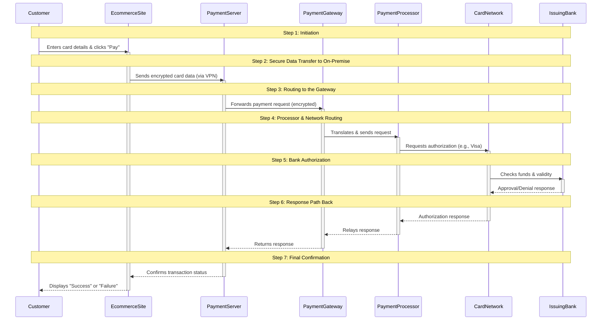

### Payment Process Sequence Diagram

---

### Step-by-Step Explanation:

1.  **Initiation:**
    *   The **Customer** enters their credit card information on the checkout page of the **E-commerce Site** and submits the order.

2.  **Secure Data Transfer to On-Premise:**
    *   The **E-commerce Site** does *not* process the payment itself. Instead, it immediately sends the sensitive card data through a secure, encrypted tunnel (VPN) to the **Payment Server** in your **On-Premise CDE**. This is a critical security step.

3.  **Routing to the Gateway:**
    *   The **Payment Server** prepares the data (may perform additional encryption or formatting) and forwards the payment request to the **Payment Gateway**.

4.  **Processor & Network Routing:**
    *   The **Payment Gateway** acts as a translator and secure router. It passes the request to the **Payment Processor**.
    *   The **Payment Processor** (the acquiring bank's partner) routes the request to the appropriate **Card Network** (e.g., Visa or Mastercard).

5.  **Bank Authorization:**
    *   The **Card Network** routes the authorization request to the customer's **Issuing Bank**.
    *   The **Issuing Bank** performs multiple checks: validates the card number, checks for sufficient funds, and performs fraud screening. It then approves or declines the transaction.

6.  **Response Path Back:**
    *   The response (Approval/Denial) travels back along the same chain: from the **Issuing Bank** to the **Card Network**, to the **Payment Processor**, to the **Payment Gateway**, and finally back to your **Payment Server**.

7.  **Final Confirmation:**
    *   The **Payment Server** informs the **E-commerce Site** of the result.
    *   The **E-commerce Site** displays the final result (a success or failure message) to the **Customer**.

This entire complex process typically happens in **2-4 seconds**, providing a seamless and secure experience for the customer.
